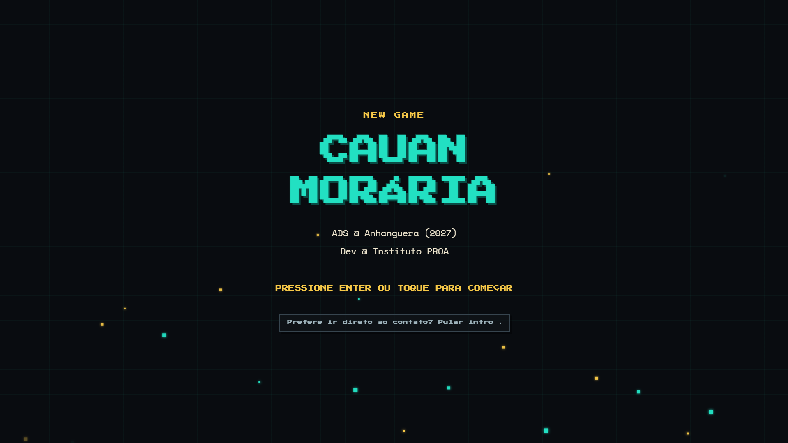
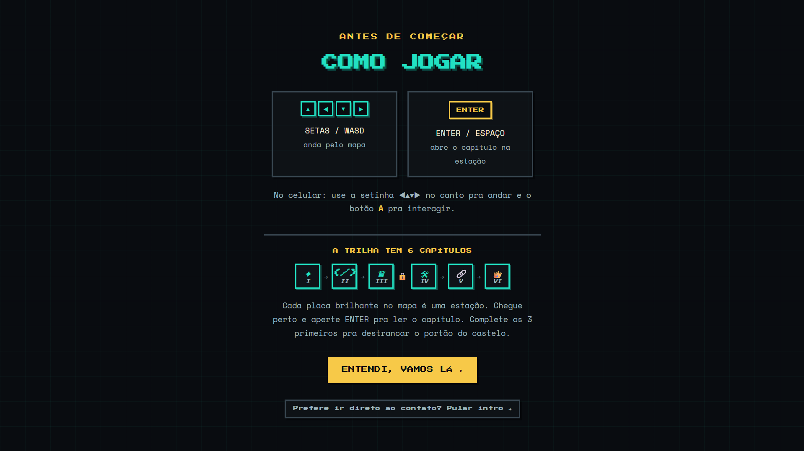
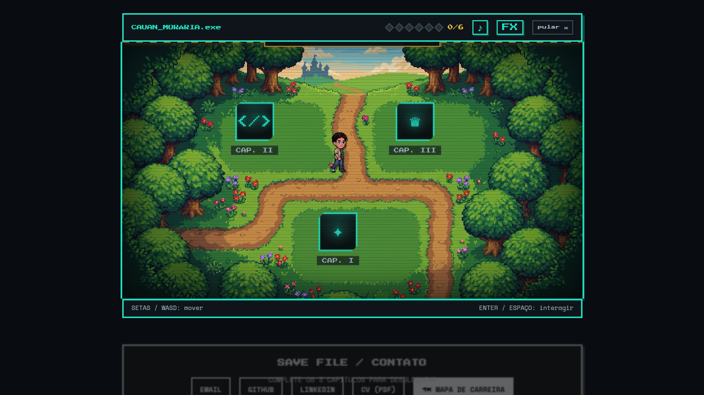
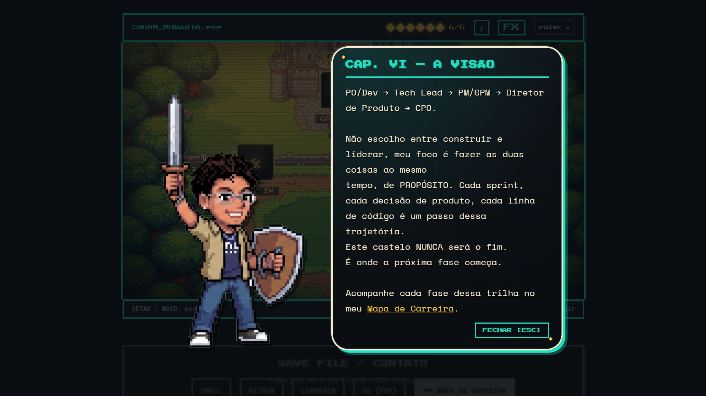
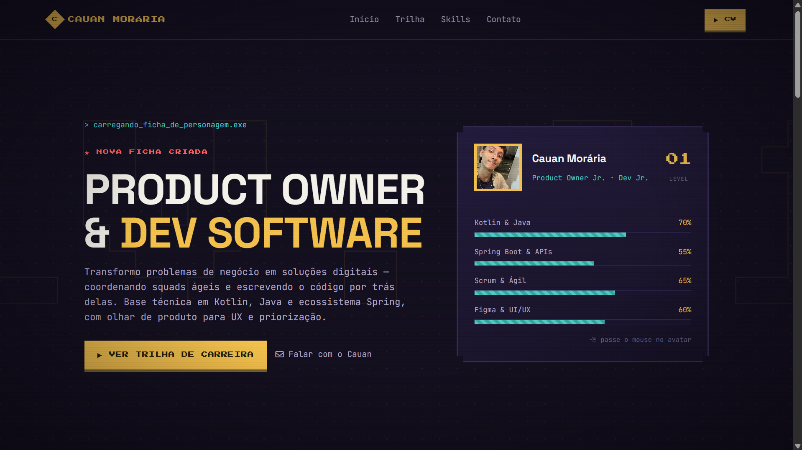

# 🎮 Cauan Moraria — Portfólio Interativo

Um portfólio em formato de mini-RPG 2D, onde em vez de rolar a página o visitante **anda pelo mapa** e visita "estações" que abrem cada capítulo da minha trajetória — origem, código, produto & liderança, projetos, comunidade e visão de carreira.

🔗 **Jogue aqui:** [devmoraria.github.io/portfolio-game](https://devmoraria.github.io/portfolio-game)

---

## 📖 Sobre

O portfólio é dividido em **6 capítulos**, representados por estações espalhadas em duas zonas do mapa (floresta e castelo). É preciso visitar os 3 primeiros capítulos pra destrancar o portão do castelo e chegar aos 3 últimos — e só depois de completar todos os 6 o rodapé de contato é liberado.

Antes de cair no mapa, uma tela de **"Como Jogar"** explica os controles e mostra a trilha dos capítulos, pra deixar claro desde o início que existe uma sequência de fases a percorrer.

## 📸 Screenshots

<table>
  <tr>
    <td width="50%">
      
      <p align="center"><sub>Tela de boot</sub></p>
    </td>
    <td width="50%">
      
      <p align="center"><sub>Tutorial — controles e trilha dos 6 capítulos</sub></p>
    </td>
  </tr>
  <tr>
    <td width="50%">
      
      <p align="center"><sub>Mapa — zona floresta, com as estações dos capítulos</sub></p>
    </td>
    <td width="50%">
      
      <p align="center"><sub>Cap. VI — a visão, com link pro Mapa de Carreira</sub></p>
    </td>
  </tr>
</table>

O último capítulo leva direto pro [Mapa de Carreira](https://devmoraria.github.io/Career-map/), outro projeto meu que documenta a trilha PO/Dev → Tech Lead → PM/GPM → Diretor de Produto → CPO:



## ✨ Funcionalidades

- Movimento livre pelo mapa (física com aceleração/atrito, inspirada no portfólio do Bruno Simon)
- Sprite do personagem com direções (frente, lado, costas, pulo)
- Diálogos em estilo caixa de texto de RPG, com retrato do personagem
- HUD com progresso dos 6 capítulos, controle de música e efeitos sonoros
- Transição animada entre as duas zonas do mapa
- Toast de conquista ao completar o portfólio
- Totalmente responsivo, com D-pad e botão de interação para mobile
- Tela de tutorial explicando os controles antes do jogo começar

## 🕹️ Controles

| Ação | Desktop | Mobile |
|---|---|---|
| Mover | Setas / WASD | D-pad na tela |
| Interagir com estação | Enter / Espaço | Botão **A** |

## 🛠️ Tecnologias

- HTML5, CSS3 e JavaScript puro (sem framework)
- [GSAP](https://gsap.com/) + ScrollTrigger para animações
- Fonte pixelada **Press Start 2P** para títulos/UI e **Space Mono** para textos de leitura

## 📁 Estrutura do projeto

```
portfolio-game/
├── index.html      # estrutura das telas (boot, tutorial, mapa, modal, rodapé)
├── style.css        # toda a estilização e responsividade
├── script.js         # lógica do jogo (movimento, colisão, capítulos, estado)
├── docs/
│   └── screenshots/    # imagens usadas neste README
└── assets/            # sprites, imagens de fundo, ícones e CV
```

## 🧭 Sobre mim

PO/Dev em formação — curso ADS na Anhanguera (formatura em 2027) e passei pelo Instituto PROA. Transito entre construir (código) e liderar (produto), sempre tentando não escolher um dos dois. Acompanhe cada fase dessa trajetória no meu [Mapa de Carreira](https://devmoraria.github.io/Career-map/).

## 📬 Contato

- [Email](mailto:cauanmorariaa@gmail.com)
- [GitHub](https://github.com/devmoraria)
- [LinkedIn](https://www.linkedin.com/in/cauan-moraria)